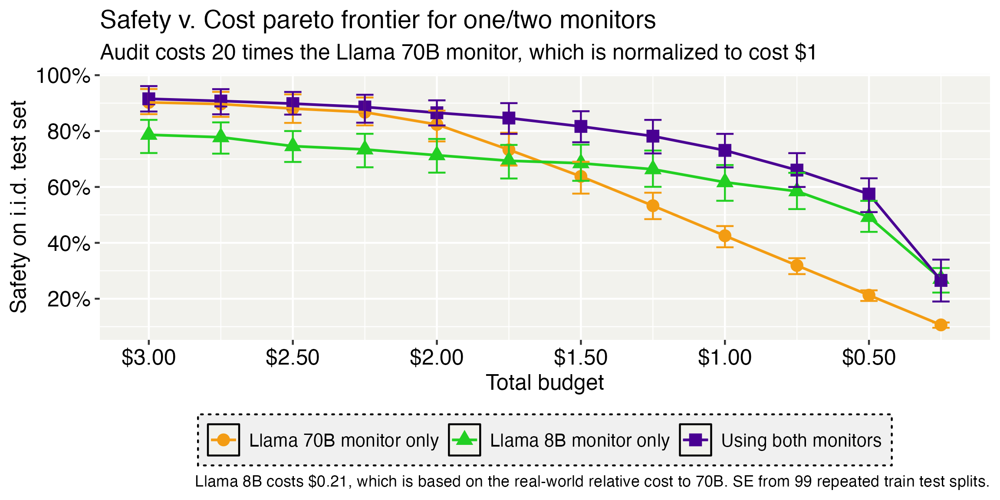

# Combining Cost-Constrained Runtime Monitors for AI Safety

Or, Hierarchical monitoring.

Code for our [arXiv paper](https://arxiv.org/abs/2507.15886) and our [Alignment Forum](https://www.alignmentforum.org/posts/FhixwyymPxF8TZX39/optimally-combining-probe-monitors-and-black-box-monitors) post. For any questions, contact the email shown at [timhua.me](https://timhua.me/).

*I kept on putting off cleaning up this codebase and putting it online, and I'm declaring defeat and uploading the code as is instead of saying "I'll clean it up and upload it later."*

We study how to combine multiple monitors with different cost and performance profiles into a single monitoring protocol. An example monitoring protocol with two monitors could be described as ``always call monitor one; call monitor two if monitor one's score is above 3, and apply the safety intervention if monitor two's score is above 7, otherwise let the output through.'' We take the monitor costs and performances as given. 

The best way to understand how this could work in practice is to read the [Alignment Forum](https://www.alignmentforum.org/posts/FhixwyymPxF8TZX39/optimally-combining-probe-monitors-and-black-box-monitors) post and the corresponding python file in `experiments/probe_comb_exp_illustrations.py`. The experiments folder also currently contains the results for the post. The underlying logic behind our main algorithm (see Algorithm 1 in page. 16 of the paper) is the `FullNPOneRegion` class in `strategy_class/new_strategies.py`. See how we combine the probe and black box monitor in the graph below.

The main script for experiments included in the arXiv paper is in `experiments/main_experiments.py`. Code for the various policy classes are in `strategy_class/`

The code in `binary_monitors`, `two_monitors`, and `single_monitor` are mostly legacy code for policies that didn't make it into the final paper. 

All processed monitor scores are included as csv files in the `data/` directory. 

All requirements are in the `requirements.txt` file. Honestly it shouldn't be too bad, there's no weird packages involved here. Most of the logic is just done with numpy. 